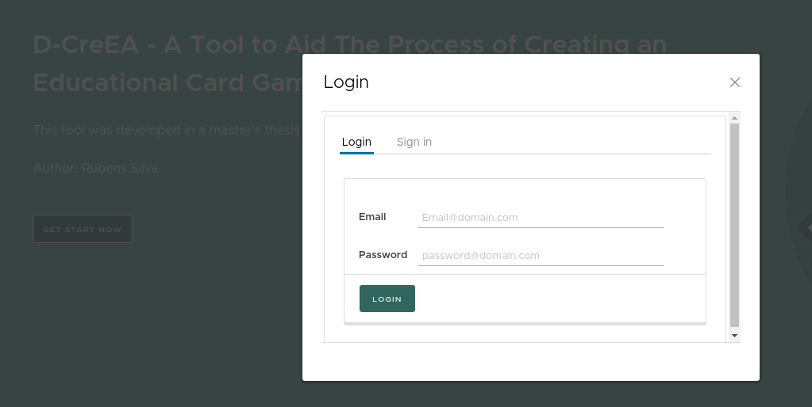
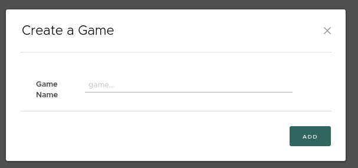
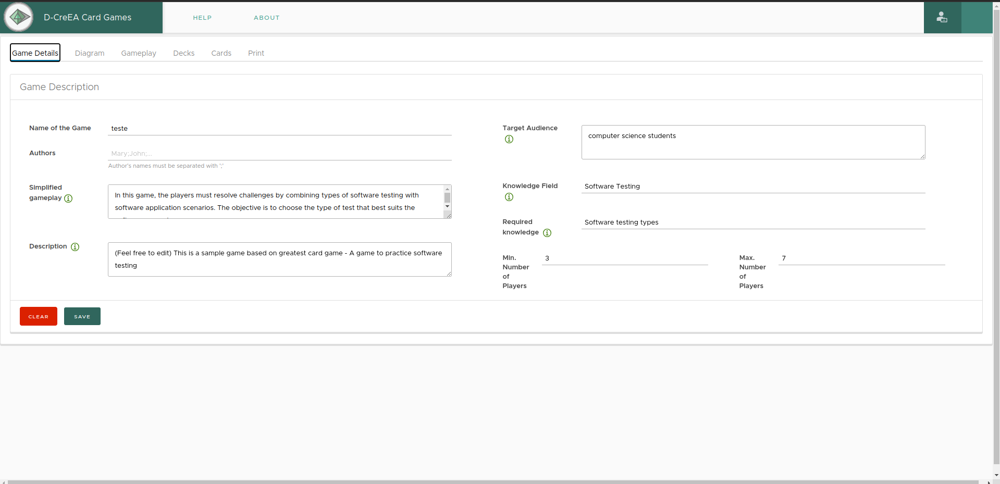
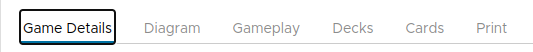
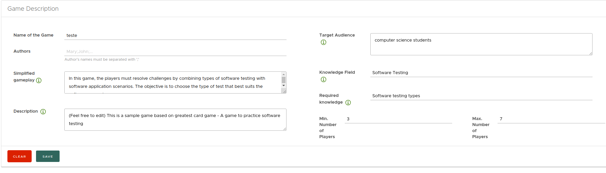
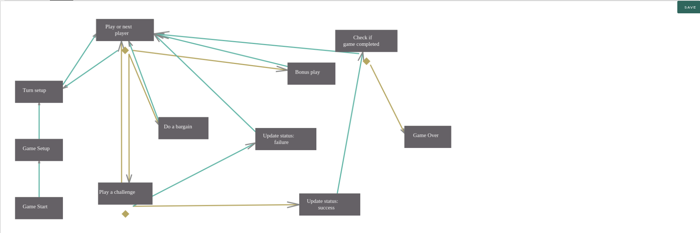
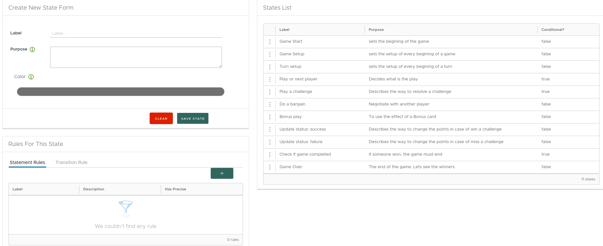
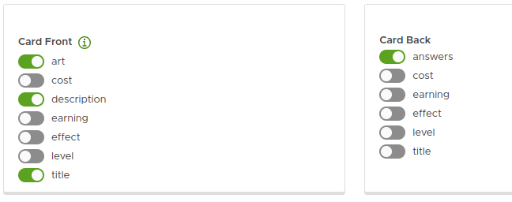
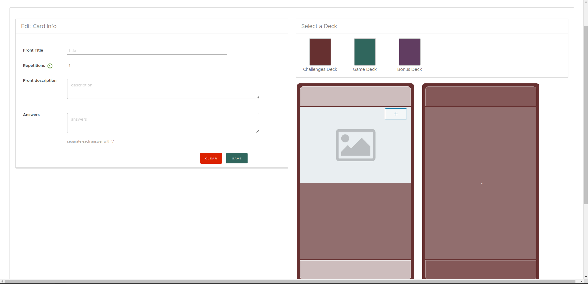
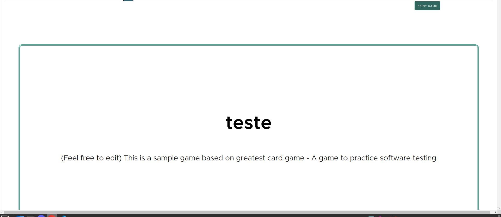

# Passo a Passo para criar um jogo:

## 0. Crie uma conta na aplicação:

## 1. Criar jogo:
No canto superior direito clique em ``Create New``  
Preencha a caixa que aparecerá com o nome do jogo
Clique em ``ADD``

## 2. Personalizar jogo

Ao se redirecionar para a nova página, preencha os campos da descrição do jogo e navegue pela barra horizontal:

## 2.1 Game Details

Coloque o nome do jogo, a descrição e a quantidade de jogadores.
## 2.2 Diagram
Manipula o diagrama

## 2.3 Gameplay
Funcionamento do jogo, criando, removendo ou alterando um estado do jogo, criando ações, eventos e regras.

## 2.4 Deck
Criar, remover ou alterar um deck manipulando sua cor, nome, descrições e inforamções.

Informações das cartas do deck

## 2.5 Cards

Crie as cartas do decks, preenchendo a informação de cada uma delas.

## 2.6 Print
Prévia do PDF do jogo e botão para gerar PDF.

